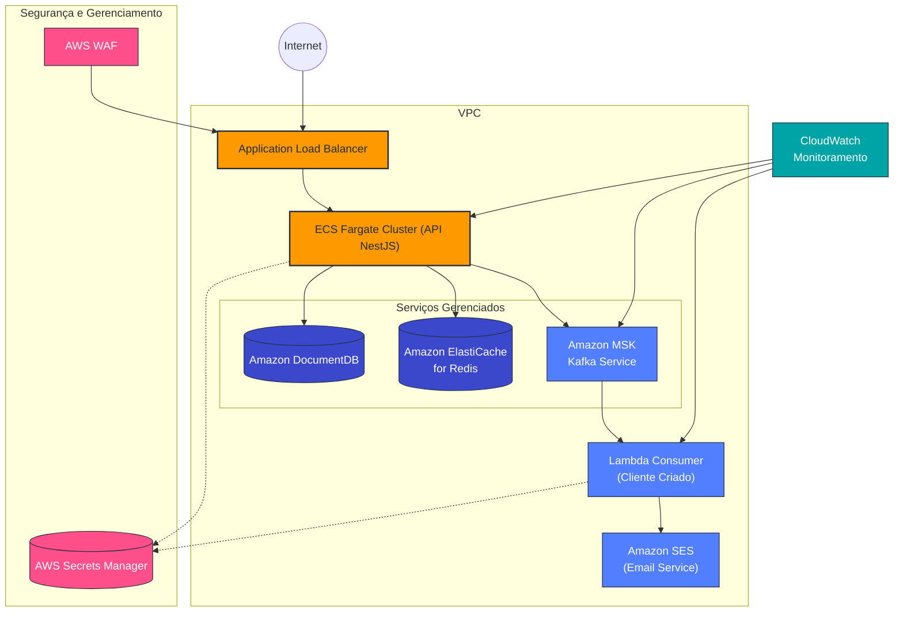
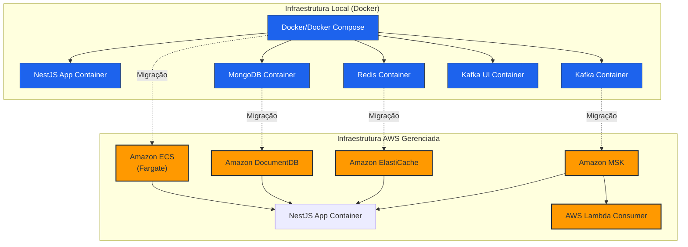
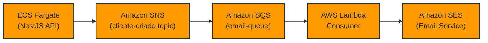
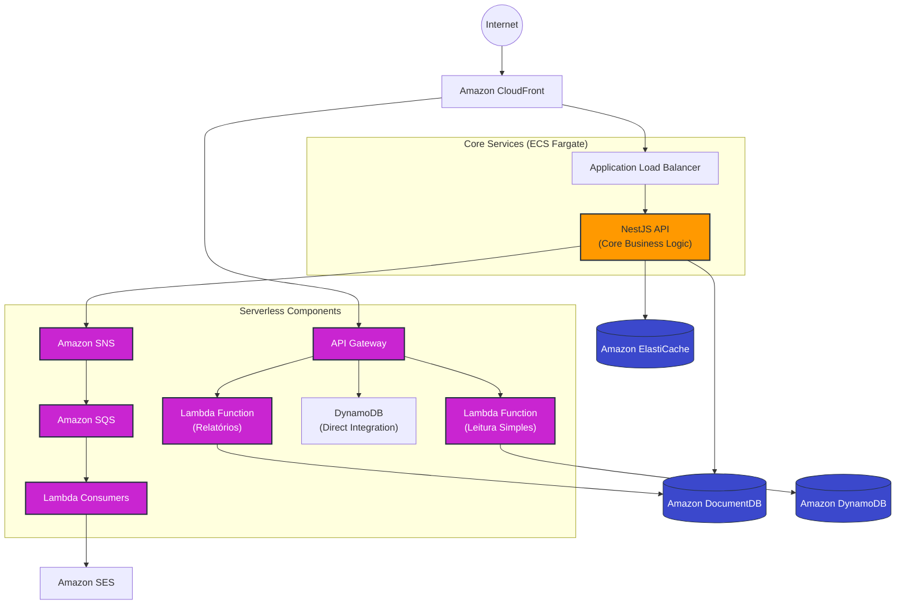
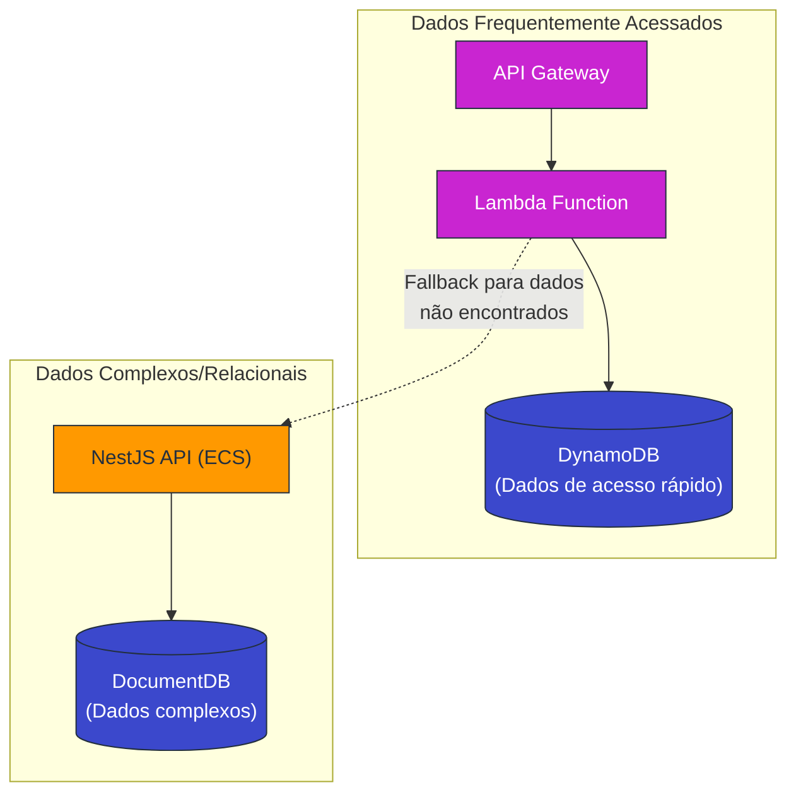
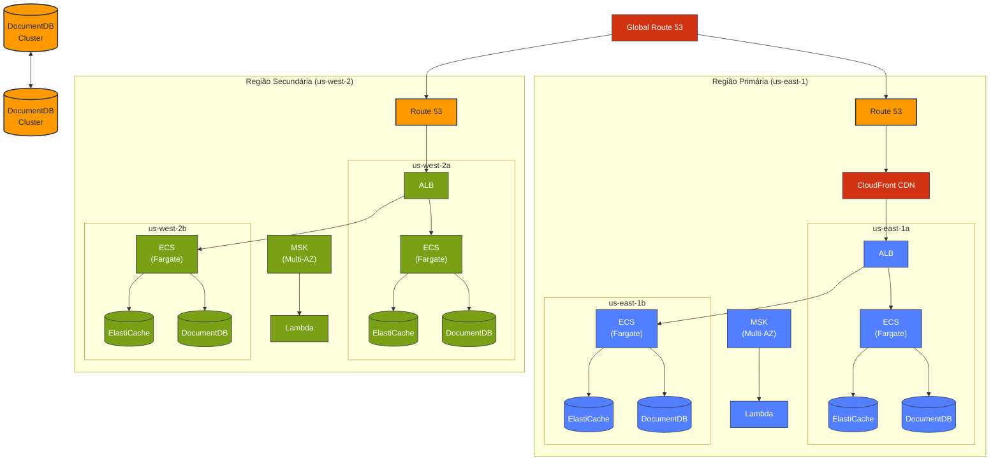
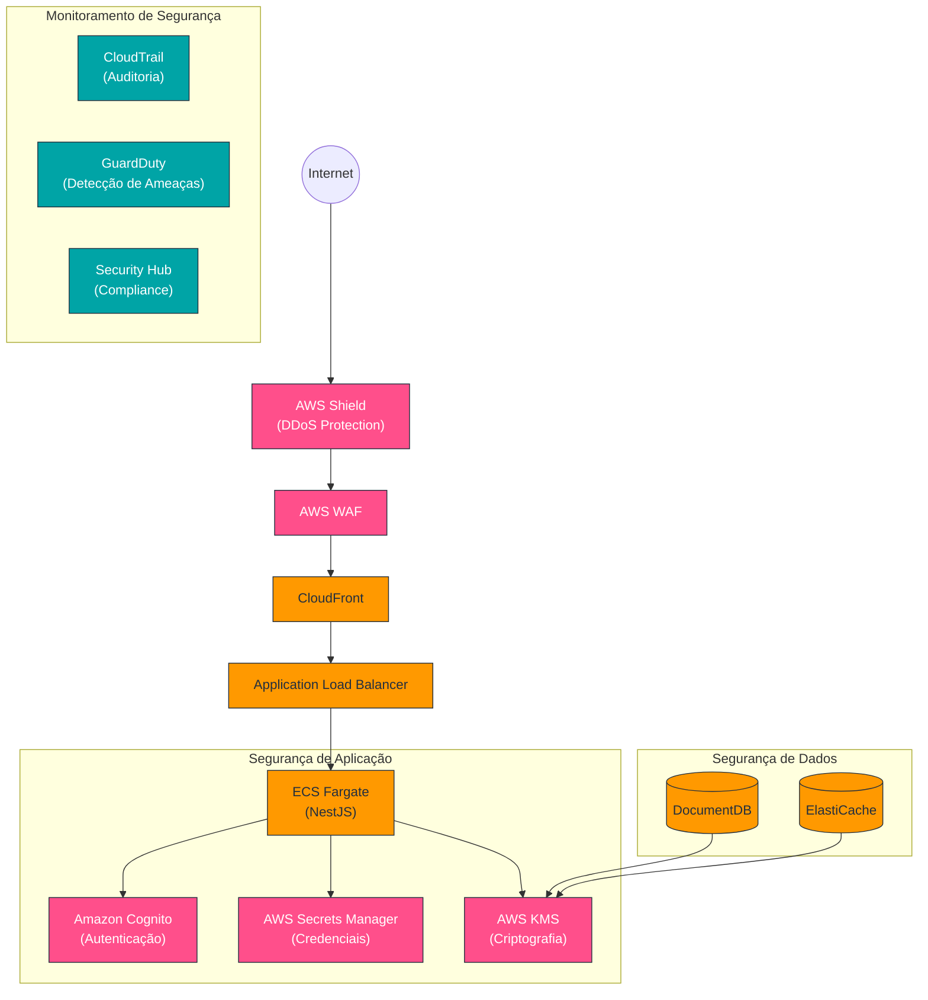
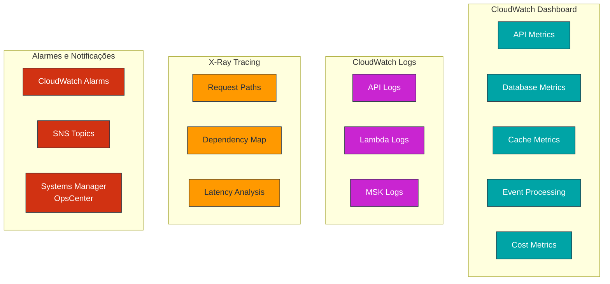

# Arquitetura AWS para Dynadok API


## 📋 Visão Geral

Este documento apresenta uma proposta de arquitetura AWS para hospedar a API NestJS da Dynadok, substituindo a infraestrutura local baseada em Docker por serviços gerenciados na nuvem. A arquitetura foi projetada considerando escalabilidade, alta disponibilidade, segurança e otimização de custos.

## 🏗️ Arquitetura Base AWS

### Diagrama de Arquitetura



### Componentes Principais

#### Computação e Orquestração

- **Amazon ECS com Fargate**: Serviço de orquestração de contêineres sem servidor para executar a API NestJS, eliminando a necessidade de gerenciar servidores.
- **Application Load Balancer (ALB)**: Distribui o tráfego para os contêineres da API, proporcionando alta disponibilidade e escalabilidade.

#### Armazenamento de Dados

- **Amazon DocumentDB**: Serviço de banco de dados compatível com MongoDB, totalmente gerenciado, substituindo o MongoDB autogerenciado.
- **Amazon ElastiCache for Redis**: Serviço Redis gerenciado para caching, substituindo o Redis autogerenciado.

#### Mensageria

- **Amazon MSK (Managed Streaming for Kafka)**: Implementação gerenciada do Apache Kafka, proporcionando processamento de eventos em tempo real.
- **AWS Lambda**: Funções serverless para processar eventos do Kafka, como o consumidor `cliente-criado`.

#### Comunicação

- **Amazon SES (Simple Email Service)**: Serviço de email para enviar mensagens de boas-vindas e outras notificações.

#### Monitoramento e Observabilidade

- **Amazon CloudWatch**: Monitoramento e observabilidade para toda a infraestrutura e aplicações.
- **AWS X-Ray**: Rastreamento e análise de requisições para identificação de problemas e otimização de performance.

#### Segurança

- **AWS WAF (Web Application Firewall)**: Proteção contra vulnerabilidades comuns da web.
- **AWS Secrets Manager**: Gerenciamento seguro de credenciais e configurações sensíveis.
- **Security Groups e Network ACLs**: Controle de acesso à rede em múltiplas camadas.

## 🔄 Transformação de Arquitetura

### Antes vs. Depois



## 🔄 Alternativas AWS para Serviços Atuais

### Opção 1: Usando SNS/SQS ao invés de Kafka



#### Vantagens desta Abordagem

- **Custos Reduzidos**: SNS/SQS geralmente são mais econômicos que MSK para casos de uso simples
- **Gerenciamento Simplificado**: Totalmente serverless, sem necessidade de clusters ou brokers
- **Integração Nativa**: Integração direta com outros serviços AWS como Lambda e SES
- **Sem Manutenção**: Nenhuma configuração de cluster, partições ou replicação necessária

#### Implementação

Substitua o serviço Kafka por:

1. **Amazon SNS (Simple Notification Service)**:
   - Crie tópicos SNS para cada tópico Kafka (ex: `cliente-criado`)
   - Ajuste o produtor no código NestJS para publicar no SNS ao invés do Kafka
   - Exemplo de código (adaptação necessária):

```typescript
// Antes (Kafka producer)
await this.kafkaService.emit('cliente-criado', {
  id: cliente.id,
  nome: cliente.nome,
  email: cliente.email,
});

// Depois (SNS producer)
await this.snsService.publish({
  TopicArn: 'arn:aws:sns:us-east-1:123456789012:cliente-criado',
  Message: JSON.stringify({
    id: cliente.id,
    nome: cliente.nome,
    email: cliente.email,
  }),
});
```

2. **Amazon SQS (Simple Queue Service)**:

   - Crie filas SQS para processamento das mensagens
   - Configure assinaturas entre tópicos SNS e filas SQS
   - Implemente filtragem de mensagens se necessário

3. **AWS Lambda**:
   - Configure Lambda para ser acionado por eventos SQS
   - Implemente a lógica do consumidor atual no handler do Lambda

### Opção 2: Arquitetura Híbrida (Microserviços + Componentes Serverless)



#### Vantagens desta Abordagem Híbrida

- **Melhor Distribuição de Responsabilidades**: Os serviços principais continuam no NestJS em ECS, mantendo a estrutura e complexidade da API bem organizadas
- **Otimização de Custos**: Funções Lambda específicas para operações simples e relatórios que são executados com menos frequência
- **Combinando Paradigmas**: Aproveita o melhor dos dois mundos - a robustez de um serviço sempre ativo para as operações principais e a escalabilidade sob demanda de componentes serverless

#### Componentes Específicos

1. **API Core (NestJS em ECS Fargate)**

   - Mantém toda a lógica de negócio complexa
   - Gerencia transações e operações que exigem consistência forte
   - Gerencia autenticação e autorização centralizadas

2. **API Gateway + Funções Lambda**

   - Rotas de leitura simples (GET) que podem ser servidas por Lambda
   - Relatórios e operações assíncronas
   - Operações eventuais que não precisam estar sempre disponíveis

3. **Integrações Diretas com DynamoDB**

   - Para operações CRUD simples, o API Gateway pode se integrar diretamente com DynamoDB
   - Reduz latência e elimina camada de código intermediária para operações simples

4. **Sistema de Mensageria com SNS/SQS**
   - Substitui o Kafka por um sistema de publicação/assinatura totalmente gerenciado
   - Consumidores implementados como funções Lambda para processamento assíncrono
   - Ideal para processamentos em background como envio de emails ou notificações

#### Implementação de Exemplo: Acesso Híbrido a Dados



## 📊 Escalabilidade e Alta Disponibilidade

### Arquitetura Multi-AZ e Multi-Região



## 💰 Estimativa de Custos e Otimização

### Serviços Principais e Estratégias de Custo

| Serviço     | Estratégia de Otimização                               | Economia Estimada |
| ----------- | ------------------------------------------------------ | ----------------- |
| ECS Fargate | Utilizar Fargate Spot para workloads não críticas      | 70%               |
| DocumentDB  | Instâncias reservadas para ambiente de produção        | 30-60%            |
| ElastiCache | Dimensionamento baseado em métricas, caching eficiente | 25-40%            |
| MSK         | Utilizar SNS/SQS para casos simples                    | 40-60%            |
| Lambda      | Otimizar memória alocada, minimizar dependências       | 30-50%            |

### Monitoramento de Custos

- **AWS Cost Explorer**: Análise detalhada de custos por serviço, tag e período
- **AWS Budgets**: Alertas de orçamento para prevenir gastos excessivos
- **Savings Plans**: Compromissos de uso para reduzir custos de computação

## 🔐 Segurança e Conformidade

### Camadas de Segurança



## 🚀 Implementação e Migração

### Estratégia de Migração Recomendada

1. **Avaliação Inicial**

   - Analisar dependências e acoplamentos
   - Definir métricas de sucesso e SLAs
   - Identificar riscos e planos de mitigação

2. **Migração de Banco de Dados**

   - Configurar DocumentDB compatível com MongoDB
   - Implementar estratégia de migração de dados
   - Validar integridade e desempenho

3. **Migração da Aplicação**

   - Containerizar a aplicação NestJS para ECS
   - Configurar balanceadores de carga e healthchecks
   - Implementar circuit breakers e resiliência

4. **Migração do Sistema de Mensageria**

   - Implementar infraestrutura de mensageria AWS (MSK ou SNS/SQS)
   - Adaptar produtores e consumidores
   - Validar entrega e processamento de eventos

5. **Adoção Gradual de Serviços Serverless**
   - Identificar casos de uso ideais para componentes serverless
   - Implementar componentes lambda para funcionalidades específicas
   - Integrar API Gateway com serviços existentes

## 📊 Monitoramento e Observabilidade

### Dashboard de Monitoramento



## 🏆 Considerações Finais

### Benefícios da Migração para AWS

1. **Escalabilidade**: Infraestrutura elástica que se adapta à demanda
2. **Disponibilidade**: Arquitetura multi-AZ e multi-região para alta disponibilidade
3. **Segurança**: Múltiplas camadas de proteção e conformidade integradas
4. **Manutenção Reduzida**: Serviços gerenciados que reduzem overhead operacional
5. **Custo Otimizado**: Pague apenas pelo que usar com opções de economia

### Próximos Passos Recomendados

1. **Prova de Conceito**: Implementar um componente isolado para validar a arquitetura
2. **Análise de TCO (Total Cost of Ownership)**: Comparar custos atuais vs. AWS
3. **Plano de Migração Detalhado**: Definir timelines e responsabilidades
4. **Treinamento da Equipe**: Capacitar a equipe nas novas tecnologias AWS
5. **Implementação Gradual**: Migrar serviços em fases com validação contínua
