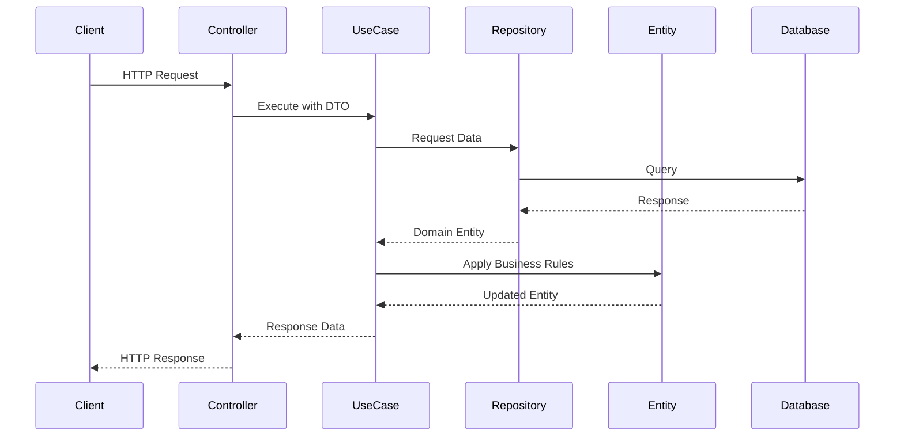
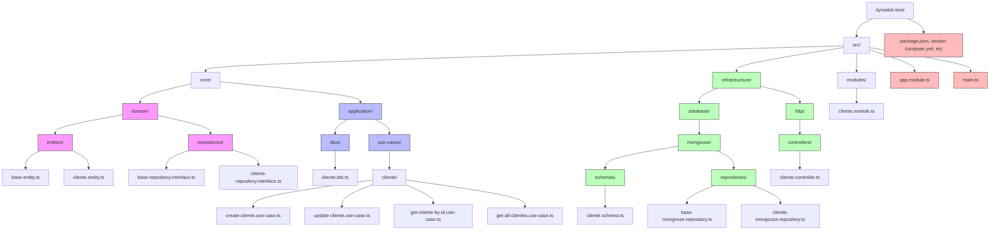
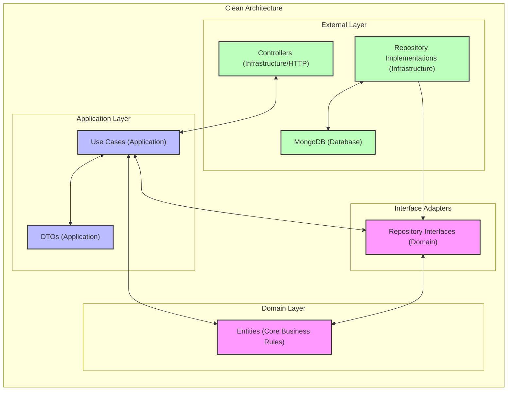

# Dynadok Technical Test


## 📘 Documentação da API

[](https://www.postman.com/universal-crescent-694463/workspace/dynadock-test-joo-pster)

👆 **Clique no badge acima para acessar a documentação da API no Postman**

## üìã Sobre o Projeto

Este é um projeto de teste técnico para a Dynadok, que consiste em uma API REST desenvolvida utilizando o framework NestJS. A aplicação é executada em um ambiente Docker containerizado, com uma configuração completa via Docker Compose e utiliza MongoDB como banco de dados.

## üîß Tecnologias Utilizadas

- **NestJS**: Framework Node.js progressivo para construção de aplicações escaláveis
- **MongoDB**: Banco de dados NoSQL orientado a documentos
- **Docker**: Plataforma de containerização para facilitar o desenvolvimento e implantação
- **Docker Compose**: Ferramenta para definir e executar aplicativos Docker multi-container

## 📁 Estrutura do Projeto e Arquitetura

O projeto segue os princípios da Clean Architecture, com separação clara de responsabilidades em camadas.

### Fluxo de Execução


```mermaid
sequenceDiagram
    participant Client
    participant Controller
    participant UseCase
    participant Repository
    participant Entity
    participant Database

    Client->>Controller: HTTP Request
    Controller->>UseCase: Execute with DTO
    UseCase->>Repository: Request Data
    Repository->>Database: Query
    Database-->>Repository: Response
    Repository-->>UseCase: Domain Entity
    UseCase->>Entity: Apply Business Rules
    Entity-->>UseCase: Updated Entity
    UseCase-->>Controller: Response Data
    Controller-->>Client: HTTP Response
```

### Estrutura de Pastas


```mermaid
graph TD
    Root["dynadok-test/"] --> SRC["src/"]
    Root --> Config["package.json, docker-compose.yml, etc"]

    SRC --> Core["core/"]
    SRC --> Infra["infrastructure/"]
    SRC --> Modules["modules/"]
    SRC --> AppModule["app.module.ts"]
    SRC --> Main["main.ts"]

    Core --> Domain["domain/"]
    Core --> Application["application/"]

    Domain --> Entities["entities/"]
    Domain --> Repos["repositories/"]

    Entities --> BaseEntity["base-entity.ts"]
    Entities --> ClienteEntity["cliente.entity.ts"]

    Repos --> BaseRepoInterface["base-repository.interface.ts"]
    Repos --> ClienteRepoInterface["cliente-repository.interface.ts"]

    Application --> DTOs["dtos/"]
    Application --> UseCases["use-cases/"]

    DTOs --> ClienteDTO["cliente.dto.ts"]

    UseCases --> ClienteUseCases["cliente/"]

    ClienteUseCases --> CreateCliente["create-cliente.use-case.ts"]
    ClienteUseCases --> UpdateCliente["update-cliente.use-case.ts"]
    ClienteUseCases --> GetClienteById["get-cliente-by-id.use-case.ts"]
    ClienteUseCases --> GetAllClientes["get-all-clientes.use-case.ts"]

    Infra --> Database["database/"]
    Infra --> HTTP["http/"]

    Database --> Mongoose["mongoose/"]

    Mongoose --> Schemas["schemas/"]
    Mongoose --> MongoRepos["repositories/"]

    Schemas --> ClienteSchema["cliente.schema.ts"]

    MongoRepos --> BaseMongoRepo["base-mongoose.repository.ts"]
    MongoRepos --> ClienteMongoRepo["cliente-mongoose.repository.ts"]

    HTTP --> Controllers["controllers/"]

    Controllers --> ClienteController["cliente.controller.ts"]

    Modules --> ClienteModule["cliente.module.ts"]

    %% Estilos para melhor visualização
    classDef domain fill:#f9f,stroke:#333,stroke-width:1px
    classDef application fill:#bbf,stroke:#333,stroke-width:1px
    classDef infrastructure fill:#bfb,stroke:#333,stroke-width:1px
    classDef config fill:#fbb,stroke:#333,stroke-width:1px

    class Entities,Repos,Domain domain
    class Application,DTOs,UseCases application
    class Infra,Database,HTTP,Controllers,Mongoose,Schemas,MongoRepos infrastructure
    class Config,AppModule,Main config
```

### Diagrama da Arquitetura Clean


```mermaid
flowchart TB
    subgraph "Clean Architecture"
        direction TB

        subgraph "External Layer"
            Controller["Controllers (Infrastructure/HTTP)"]
            DB["MongoDB (Database)"]
            Repositories["Repository Implementations (Infrastructure)"]
        end

        subgraph "Interface Adapters"
            RepositoryInterfaces["Repository Interfaces (Domain)"]
        end

        subgraph "Application Layer"
            UseCases["Use Cases (Application)"]
            DTOs["DTOs (Application)"]
        end

        subgraph "Domain Layer"
            Entities["Entities (Core Business Rules)"]
        end

        %% Conexões
        Controller <--> UseCases
        UseCases <--> RepositoryInterfaces
        UseCases <--> Entities
        UseCases <--> DTOs
        Repositories <--> DB
        Repositories --> RepositoryInterfaces
        RepositoryInterfaces <--> Entities

        %% Estilo
        classDef domain fill:#f9f,stroke:#333,stroke-width:2px
        classDef application fill:#bbf,stroke:#333,stroke-width:2px
        classDef infrastructure fill:#bfb,stroke:#333,stroke-width:2px

        class Entities,RepositoryInterfaces domain
        class UseCases,DTOs application
        class Controller,DB,Repositories infrastructure
    end
```

## üìã Endpoints da API

### Clientes

| Método | Endpoint        | Descrição                       |
| ------ | --------------- | ------------------------------- |
| `GET`  | `/clientes`     | Lista todos os clientes         |
| `GET`  | `/clientes/:id` | Busca um cliente pelo ID        |
| `POST` | `/clientes`     | Cadastra um novo cliente        |
| `PUT`  | `/clientes/:id` | Atualiza os dados de um cliente |

### Exemplo de Payload para Criação de Cliente

```json
{
  "nome": "Jo√£o Silva",
  "email": "joao.silva@exemplo.com",
  "telefone": "11999998888",
  "cpf": "12345678900",
  "endereco": "Rua Exemplo, 123 - S√£o Paulo/SP"
}
```

## ⚙️ Pré-requisitos

Antes de começar, você vai precisar ter instalado em sua máquina:

- [Git](https://git-scm.com)
- [Node.js](https://nodejs.org/en/) (recomendado vers√£o LTS)
- [Docker](https://www.docker.com/get-started)
- [Docker Compose](https://docs.docker.com/compose/install/)
- [Yarn](https://yarnpkg.com/) (opcional, mas recomendado)

## üöÄ Como executar o projeto

### Clonando o repositório

```bash
git clone <repository-url>
cd dynadok-test
```

### Instalando as dependências

```bash
yarn install
# ou
npm install
```

### Executando com Docker Compose

O projeto está configurado para ser facilmente executado através do Docker Compose, que gerenciará tanto o container da aplicação NestJS quanto o MongoDB.

#### Iniciar os containers

```bash
yarn docker:up
# ou
npm run docker:up
```

#### Iniciar os containers reconstruindo as imagens

```bash
yarn docker:up:rebuild
# ou
npm run docker:up:rebuild
```

#### Parar os containers

```bash
yarn docker:down
# ou
npm run docker:down
```

#### Parar os containers e remover volumes

```bash
yarn docker:down:volumes
# ou
npm run docker:down:volumes
```

### Acessando a API

Após iniciar os containers, a API estará disponível em:

```
http://localhost:3000
```

## üß™ Testes

```bash
# testes unit√°rios
yarn test

# testes e2e
yarn test:e2e

# cobertura de testes
yarn test:cov
```

## 📄 Licença

Este projeto está sob a licença UNLICENSED.

---

Desenvolvido para o teste técnico da Dynadok.
